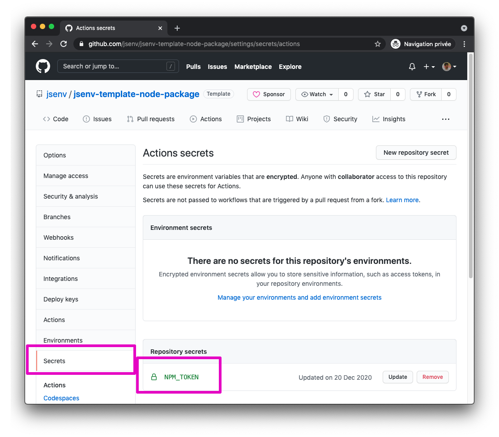

# Auto publish on npm

The main GitHub workflow is publishing new version of the package to npm **automatically** under certain circumstances. This behaviour could be translated into the following sentence:

> When `"version"` in `package.json` on the main branch is not published and if tests are passing, then publish this new version.

If you want to keep auto publish on npm, check [How to use auto publish](#how-to-use-auto-publish). Otherwise see [How to remove auto publish](#how-to-remove-auto-publish).

# How to use auto publish

It is implemented by `publish package` in [.github/workflows/main.yml](../../.github/workflows/main.yml#62).

The code responsible to publish the package on npm is [.github/workflows/main/publish-package.js](../../.github/workflows/main/publish-package.js). As explained, if the package registry already got this package version this code will not publish anything.

To enable this feature you need to:

<details>
  <summary>1. Create an access token for npm</summary>

It is documented in [Creating and viewing access tokens](https://docs.npmjs.com/creating-and-viewing-access-tokens)

</details>

<details>
  <summary>2. Add the npm token to the GitHub repository secrets</summary>

It is documented in [Creating encrypted secrets for a repository](https://docs.github.com/en/actions/reference/encrypted-secrets#creating-encrypted-secrets-for-a-repository).

The result looks like this:



The secret name must be `NPM_TOKEN` or you need to update `secrets.NPM_TOKEN` in [.github/workflows/main.yml](../../.github/workflows/main.yml#L65)

</details>

## Why auto publish ?

In a continuous delivery workflow the code is pushed to production as soon as it reaches the prod branch. As a package author, I was sick of running `npm publish` several times per day.

Putting side by side "I am tired of running this everyday" and continuous delivery I realized that publishing a package to a registry is like pushing code to production. And it could and should be automated.

As a bonus, it makes it possible to publish package on multiple registries at once (npm + github for example). You just have to add the registry url and token in [.github/workflows/main/publish-package.js](../../.github/workflows/main/publish-package.js)

```diff
  "https://registry.npmjs.org": {
    token: process.env.NPM_TOKEN,
  },
+  "https://npm.pkg.github.com": {
+    token: process.env.GITHUB_TOKEN,
+  }
```

# How to remove auto publish

1. Remove `publish package` in [.github/workflows/main.yml](../../.github/workflows/main.yml#62).
2. Delete [.github/workflows/main/publish-package.js](../../.github/workflows/main/publish-package.js)
3. Remove `"@jsenv/package-publish"` from `"devDependencies"` in [package.json](../../package.json#L62)
