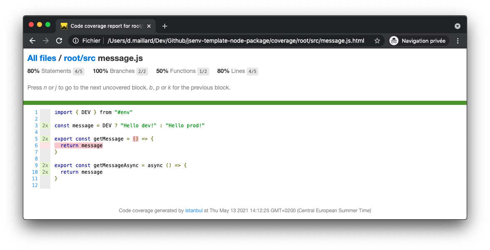

# How to use code coverage

This repository can generate code coverage report for test files. This report shows which part of the source files code have been executed during test files execution.

  
npm run test-with-coverage

## HTML coverage report

The execution of `npm run test-with-coverage` logs a link to an HTML file. This HTML file lets you naviguate in the coverage report and looks like this:

## Codecov

[Codecov](https://docs.codecov.io/docs/pull-request-comments) is being used to get coverage report in pull requests.

And to display a badge in the readme.

To achieve this, code coverage is sent to codecov after each push to a pull request and each push on the repository main branch. This is done by `upload coverage` in [./.github/workflows/main.yml](../../.github/workflows/main.yml#L49).

If you want to enable this feature, see [Configure codecov](#Configure-codecov), otherwise see [Remove codecov](#Remove-codecov).

### Configure codecov

1. Create an account on codecov at https://about.codecov.io/sign-up
2. Install codecov GitHub application https://github.com/apps/codecov
3. Give repository access to codecov application
4. Review [codecov.yml](../../codecov.yml)

### Remove codecov

1. Remove `upload coverage` in [.github/workflows/main.yml](../../.github/workflows/main.yml#L49)
2. Remove `"@jsenv/codecov-upload"` from `"devDependencies"` in [package.json](../../package.json#L61)
3. Remove `"upload-coverage"` from `"scripts"` in [package.json](../../package.json#L51)
4. Remove [script/upload-coverage/](../../script/upload-coverage/)
5. Remove [codecov.yml](../../codecov.yml)

# How to remove code coverage

1. Follow steps from [Remove codecov](#Remove-codecov)
2. Replace `npm run test-with-coverage` by `npm test` in [.github/workflows/main.yml](../../.github/workflows/main.yml#L48)
3. Remove `"test-with-coverage"` from `"scripts"` in [package.json](../../package.json#L47)
4. Remove `/coverage/` in [.gitignore](../../.gitignore#L9)
5. Remove `/coverage/` in [.eslintignore](../../.eslintignore#L13)
6. Remove `/coverage/` in [.prettierignore](../../.prettierignore#L13)
