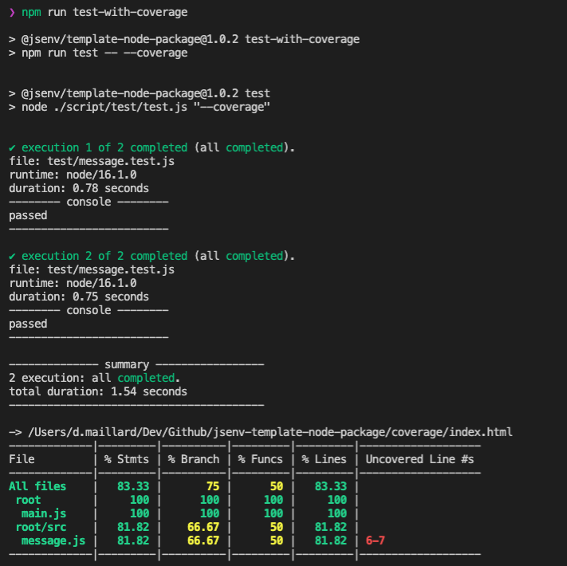

# Coverage

Code coverage shows which part of the source files code have been covered by the execution of test files.

You can get coverage locally on your machine. It is also integrated to GitHub using [Codecov](https://docs.codecov.io/docs/pull-request-comments).

Codecov will post message into pull requests.

And is used to display a badge in the readme.

If you want to keep code coverage check [How to use code coverage](#How-to-use-code-coverage). Otherwise see [How to remove code coverage](#How-to-remove-code-coverage)

# How to use code coverage

List of commands related to the coverage:

  
npm run test-with-coverage

Execute tests and collect associated code coverage. Also generates an html coverage report.

HTML files can be opened in a browser to naviguate coverage and look like this:

## Codecov

To enable integration into GitHub, coverage must be sent to codecov after each push to a pull request or the repository main branch. This is done by `upload coverage` in [./.github/workflows/main.yml](../../.github/workflows/main.yml).

If you want to enable this, see [Configure codecov](#Configure-codecov), otherwise see [Remove codecov](#Remove-codecov).

### Configure codecov

1. Create an account on codecov at https://about.codecov.io/sign-up
2. Install codecov GitHub application https://github.com/apps/codecov
3. Give repository access to codecov application
4. Review [codecov.yml](../../codecov.yml)

### Remove codecov

1. Remove `upload coverage` in [.github/workflows/main.yml](../../.github/workflows/main.yml)
2. Remove `"@jsenv/codecov-upload"` from `"devDependencies"` in [package.json](../../package.json#)
3. Remove `"upload-coverage"` from `"scripts"` in [package.json](../../package.json)
4. Delete [script/upload-coverage/](../../script/upload-coverage/) directory
5. Delete [codecov.yml](../../codecov.yml)

# How to remove code coverage

1. Follow steps from [Remove codecov](#Remove-codecov)
2. Replace `npm run test-with-coverage` by `npm test` in [.github/workflows/main.yml](../../.github/workflows/main.yml)
3. Remove `"test-with-coverage"` from `"scripts"` in [package.json](../../package.json)
4. Remove `/coverage/` in [.gitignore](../../.gitignore)
5. Remove `/coverage/` in [.eslintignore](../../.eslintignore)
6. Remove `/coverage/` in [.prettierignore](../../.prettierignore)
