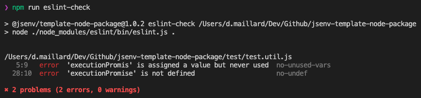

# How to use ESLint

The ESLint configuration can be found in [.eslintrc.cjs](../../.eslintrc.cjs).

It is recommended to install and use [vscode-eslint](https://marketplace.visualstudio.com/items?itemName=dbaeumer.vscode-eslint) to have **ESLint integrated in VSCode**.

If ESLint rules are not respected, the main **GitHub workflow will fail** during [check lint step](../../.github/workflows/main.yml#L45).

You can also run a command to check all your file against ESLint rules:

There is one command for ESLint

  
npm run eslint-check

Execute ESLint command on all files.

# How to remove ESLint

If for some reason you want to remove ESLint from this repository, follow the steps below.

1. Remove `check lint` step in [.github/workflows/main.yml](../../.github/workflows/main.yml#L43)
2. Remove `"eslint-check"` from `"scripts"` in [package.json](../../package.json#L42)
3. Remove `"eslint"` from `"devDependencies"` in [package.json](../../package.json#L68)
4. Remove `"@jsenv/eslint-config"` from `"devDependencies"` in [package.json](../../package.json#L63)
5. Remove [.eslintignore](../../.eslintignore)
6. Remove [.eslintrc.cjs](../../.eslintrc.cjs)
