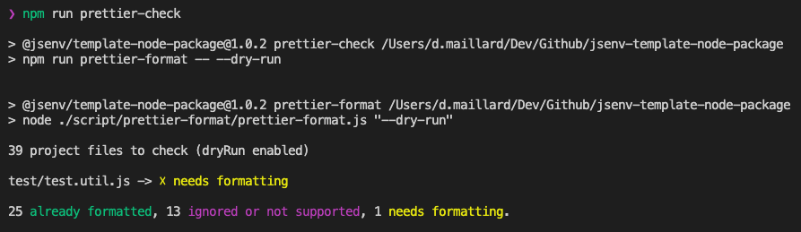
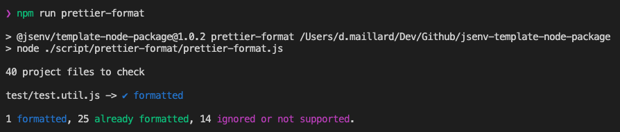

# Prettier

The codebase uses [prettier](https://prettier.io) to ensure files formatting is coherent and pretty.

If prettier configuration is not respected, nothing special happen.

If you want to keep prettier, check [How to use Prettier](#How-to-use-prettier). Otherwise see [How to remove prettier](#How-to-remove-prettier)

# How to use prettier

The prettier configuration can be found in [.prettierrc.yml](../../.prettierrc.yml).

Install [prettier-vscode](https://marketplace.visualstudio.com/items?itemName=esbenp.prettier-vscode) and **let the extension do the formatting** when you save a file.

This repository has pre-configured some commands related to prettier:

  
npm run prettier-check

Logs files matching and not matching prettier formatting.

  
npm run prettier-format

Format all files in the project.

  
npm run prettier-format-stage

Format all files in the [git staging area](https://softwareengineering.stackexchange.com/a/119790)

# How to remove prettier

If you want to remove prettier from this repository, follow the steps below.

1. Remove prettier scripts from `"scripts"` in [package.json](../../package.json#L51)
2. Delete [.prettierignore](../../.prettierignore)
3. Delete [.prettierrc.yml](../../.prettierrc.yml)
4. Remove these `"devDependencies"` in [package.json](../../package.json#L71):
   - `"@jsenv/prettier-check-project"`
   - `"prettier"`
