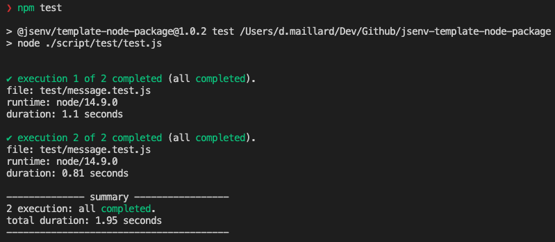
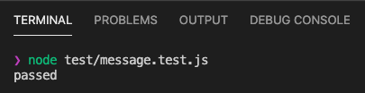
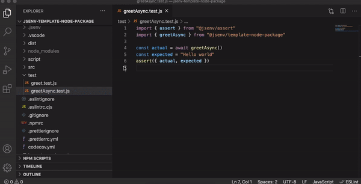

<!-- https://github.com/github/docs/blob/main/tests/README.md -->

# Tests

All test files are inside the [test/](./test/) directory and ends with `.test.js`.

These files are executed twice, the second execution ensure code specific to _production_ is also tested. Read more in [Production mode](../production/production.md#How-to-use-production-mode).

If one or more test execution is failing, the main **GitHub workflow will fail** during [check tests](../../.github/workflows/main.yml#L47) step.

The test files code coverage report can be generated locally and is also sent to codecov by the main Github workflow. Read more in [coverage](../coverage/coverage.md).

If you want to keep test files check [How to use tests](#How-to-use-tests). Otherwise see [How to remove tests](#How-to-remove-tests)

# How to use tests

The test script can be found in [script/test/test.js](../../script/test/test.js).

## Executing all tests

  
npm test

Run all tests

## Executing a single test

Tests are written using [jsenv](https://github.com/jsenv/jsenv-core). This is a test runner which see test files as regular files so each test file can be executed independently.

  
node test/message.test.js

See [test/message.test.js](../../test/message.test.js)

And debugged independently using [VSCode debugger for Node.js](https://code.visualstudio.com/docs/nodejs/nodejs-debugging) or any debugging recipe documented in [Node.js debugging guide](https://nodejs.org/en/docs/guides/debugging-getting-started).

  
See test file debugging in VSCode

# How to remove tests

If you don't need test or want to use an other test framework/library follow the steps below.

1. Remove `check tests` step in [.github/workflows/main.yml](../../.github/workflows/main.yml#L45)
2. Remove `"test"` from `"scripts"` in [package.json](../../package.json#L44)
3. Remove `"test-with-coverage"` from `"scripts"` in [package.json](../../package.json#L47)
4. Delete [script/test/](../../script/test/) directory
5. Remove `"@jsenv/assert"` from `"devDependencies"` [package.json](../../package.json#L60)
