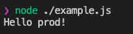

# Jsenv template node package.

Template to create a GitHub repository for a node package.

**Warning**: It's a beta version.

[](https://www.npmjs.com/package/@jsenv/template-node-package)
[](https://github.com/jsenv/jsenv-template-node-package/actions?workflow=ci)
[](https://codecov.io/gh/jsenv/jsenv-template-node-package)

# Table of contents

- [Presentation](#Presentation)
- [Usage](#Usage)
- [API](#API)
- [Contributing](#Contributing)

# Presentation

This is a dumb node package published on npm used to demonstrate this [GitHub repository template](https://docs.github.com/en/github-ae@latest/github/creating-cloning-and-archiving-repositories/creating-a-repository-from-a-template#creating-a-repository-from-a-template).

```js
import { getMessage } from "@jsenv/template-node-package"

console.log(getMessage())
```

Code above logs `"Hello prod!"`.

# Usage

## Installation

```console
npm install @jsenv/template-node-package
```

## Example

<details>
  <summary>Create <code>example.js</code></summary>

```js
import { getMessage } from "@jsenv/template-node-package"

console.log(getMessage())
```

The package also provides files written in commonjs. It means you can also `require` it as shown below.

```js
const { getMessage } = require("@jsenv/template-node-package")

console.log(getMessage())
```

</details>

<details>
  <summary>Execute with node</summary>

`example.js` can be executed with the `node` command.

```console
node ./example.js
```

It would log `Hello prod!` in the terminal as shown in the screenshot below.



</details>

<details>
  <summary>Development mode</summary>

This package have two mode: development and production. By default this package will use the production mode. But the development mode can be enabled using [--conditions=development](https://nodejs.org/docs/latest-v15.x/api/packages.html#packages_resolving_user_conditions).

```console
node --conditions=development example.js
```


> For this dumb package the effect of development mode is trivial. In a real package, development mode can provide additional logs and feature.

> Feel free to remove the development mode if you don't need it.

</details>

# Contributing

The following setup is required to install this repository on your machine:

**Operating System**: Mac, Linux or Windows.

**Code editor**: [Visual Studio Code](https://code.visualstudio.com/).

**Command line tools**:

- [git](https://git-scm.com/) version 2.26.0 or above
- [node](https://nodejs.org/en/) version 14.9.0 or above

If setup is done, run the following commands:

```console
git clone git@github.com:jsenv/jsenv-template-node-package.git
```

```console
npm install
```

## Coding

While coding, you can simply use `node` command to execute the file. But you will likely prefer to execute file using [VSCode integrated debugger for Node.js](https://code.visualstudio.com/docs/nodejs/nodejs-debugging). This repository contains a pre-defined launch configuration for VSCode at [.vscode/launch.json#L2](./.vscode/launch.json#L5). It's a classic node configuration enabling some flags like [--experimental-top-level-await](https://nodejs.org/docs/latest-v14.x/api/cli.html#cli_experimental_repl_await)

<details>
  <summary>See VSCode debugging a Node.js file</summary>


</details>

## Formatting

The codebase uses prettier to ensure a coherent and pretty code formatting. The prettier configuration can be found in [.prettierrc.yml](./.prettierrc.yml).

If prettier configuration is not respected, the main **GitHub workflow will log** which files are incorrect during [code format step](./.github/workflows/ci.yml#L33). I repeat, the workflow will not fail, just log.

You are supposed to perform the code formatting, in other words install [prettier-vscode](https://marketplace.visualstudio.com/items?itemName=esbenp.prettier-vscode) and let the extension do it when you save a file.

## Linting

The codebase uses ESLint to lint files. The ESLint configuration can be found in [.eslintrc.cjs](./.eslintrc.cjs). The ESLint configuration consider all files as written for a browser except thoose inside `script/` and `github/` directories. The rest of the configuration comes from [@jsenv/eslint-config](https://github.com/jsenv/jsenv-eslint-config#eslint-config).

If ESLint rules are not respected, the main **GitHub workflow will fail** during [code quality step](./.github/workflows/ci.yml#L45).

You can run `npm run eslint-check` to ensure your file respects ESLint rules. It is recommended to install and use [vscode-eslint](https://marketplace.visualstudio.com/items?itemName=dbaeumer.vscode-eslint) to have ESLint integrated in VSCode.

## Testing

Test are inside [test/](./test/) directory.

They can be runned all at once using `npm test`.

They can be runned selectively in node by executing the file directly with the `node` command or with VSCode debugger as documented in [coding](#coding)

Read more in [jsenv testing documentation](https://github.com/jsenv/jsenv-core#testing)

## Building

In order to generate files that will be published on npm use `npm run dist`. This will generate files into [dist/](./dist/) directory.

The files will be generated in `commonjs` to allow consumer of the package to use `require` on it. It means [main.js](./main.js) written using standard ES module format is converted into CommonJS module format and written at [dist/commonjs/main.cjs](./dist/commonjs/main.cjs).

Read more in [jsenv building documentation](https://github.com/jsenv/jsenv-core/blob/master/docs/building/readme.md#Building-a-nodejs-package).

TODO: explain the two builds (one for prod, one for dev)
TODO: explain the github workflow (it's auto publishing on npm)
