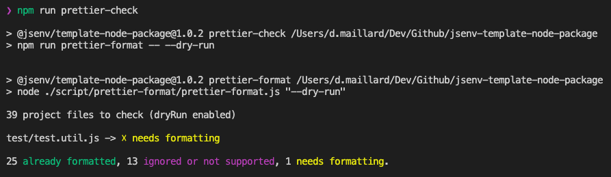
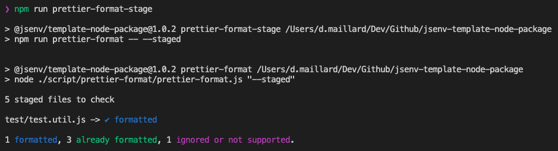
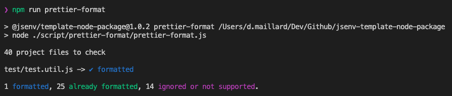

<!-- https://github.com/orbitdb/repo-template -->

# Jsenv node package template

This repository is meant to serve as a general template for how to set up repositories publishing a node package on npm. Use this repository as a way of finding example files, and use the following checklist to ensure that you've set up the repository correctly.

**Warning**: It's a beta version.

# Install checklist

Go through this checklist after creating your repository.

## ESLint review

The codebase uses [ESLint](https://eslint.org) to lint files.

If you want to keep ESLint, check how it is used in [ESLint usage](#eslint-usage). Otherwise see [Removing ESLint](#Removing-eslint).

- [ ] ESLint review done

## Prettier review

The codebase uses [prettier](https://prettier.io) to ensure files formatting is coherent and pretty.

If you want to keep prettier check how it is used in [Prettier usage](#prettier-usage). Otherwise see [Removing prettier](#Removing-prettier)

- [ ] Prettier review done

## Test review

All test files are inside the [test/](./test/) directory and ends with `.test.js`.

If you want to keep test files check how they are used in [Test usage](#test-usage). Otherwise see [Removing tests](#Removing-tests)

- [ ] Test review done

## Github workflow review

document the need for codecov token during codecov
document the need for npm token during auto publish

- [ ] GitHub workflow review done

## Build review

- [ ] Build review done

## Replace readme

- [ ] Readme replaced

# ESLint usage

The ESLint configuration can be found in [.eslintrc.cjs](./.eslintrc.cjs).

It is recommended to install and use [vscode-eslint](https://marketplace.visualstudio.com/items?itemName=dbaeumer.vscode-eslint) to have **ESLint integrated in VSCode**.

If ESLint rules are not respected, the main **GitHub workflow will fail** during [code quality step](./.github/workflows/main.yml#L45).

You can also run a command to check all your file against ESLint rules:

There is one command for ESLint

  
npm run eslint-check

Execute ESLint command on all files.

# Prettier usage

The prettier configuration can be found in [.prettierrc.yml](./.prettierrc.yml).

Install [prettier-vscode](https://marketplace.visualstudio.com/items?itemName=esbenp.prettier-vscode) and **let the extension do the formatting** when you save a file.

If prettier configuration is not respected, the main **GitHub workflow will log** which files are incorrect during [code format step](./.github/workflows/ci.yml#L33).

There is 3 commands for prettier

  
npm run prettier-check

Logs all files matching and not matching prettier format.

  
npm run prettier-format-stage

Format all files in the [git staging area](https://softwareengineering.stackexchange.com/a/119790)

  
npm run prettier-format

Format all files in the project.

# Tests usage

It's not strictly necessary to run tests locally while developing: You can always open a pull request and rely on the GitHub workflow to run tests for you, but sometimes it's helpful to run tests locally before pushing your changes.

There is 2 commands for tests

  
npm test

Run all tests

  
npm run test-with-coverage

Run all tests and generate associated coverage into

# Removing ESLint

1. Remove `check lint` step in [.github/workflows/main.yml](./.github/workflows/main.yml#L43)
2. Remove `"eslint-check"` from `"scripts"` in [package.json](./package.json#L42)
3. Remove `"eslint"` from `"devDependencies"` in [package.json](./package.json#L68)
4. Remove `"@jsenv/eslint-config"` from `"devDependencies"` in [package.json](./package.json#L63)
5. Remove [.eslintignore](./.eslintignore)
6. Remove [.eslintrc.cjs](./.eslintrc.cjs)

# Removing prettier

1. Remove `check format` step in [.github/workflows/main.yml](./.github/workflows/main.yml#L45)
2. Remove prettier scripts from `"scripts"` in [package.json](./package.json#L48)
3. Remove `"prettier"` from `"devDependencies"` in [package.json](./package.json#L69)
4. Remove [.prettierignore](./.prettierignore)
5. Remove [.prettierrc.yml](./.prettierrc.yml)
