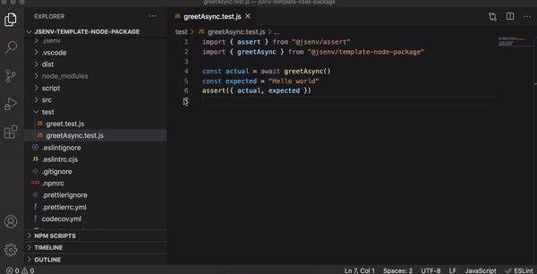

# Jsenv template node package.

Template to create a GitHub repository for a node package.

**Warning**: It's a beta version.

[](https://www.npmjs.com/package/@jsenv/template-node-package)
[](https://github.com/jsenv/jsenv-template-node-package/actions?workflow=main)
[](https://codecov.io/gh/jsenv/jsenv-template-node-package)

# Table of contents

- [Template introduction](#Template-introduction)
- [Presentation](#Presentation)
- [Usage](#Usage)
- [API](#API)
- [Development lifecyle](#Development-lifecycle)

# Template introduction

This repository is a [GitHub repository template](https://docs.github.com/en/github-ae@latest/github/creating-cloning-and-archiving-repositories/creating-a-repository-from-a-template#creating-a-repository-from-a-template). It is meant to be used as a starting point to create a node package published on npm. This repository publishes a basic npm package for demonstration purposes: `@jsenv/template-node-package`.

This readme has two purposes:

1. Document how to use `@jsenv/template-node-package` (the package published on npm)
2. Document how to use the GitHub repository template in the [Contributing](#Contributing) section.

# Presentation

```js
import { getMessage } from "@jsenv/template-node-package"

console.log(getMessage())
```

Code above logs `"Hello prod!"`.

# Usage

## Installation

```console
npm install @jsenv/template-node-package
```

## Example

<details>
  <summary>Create <code>example.js</code></summary>

```js
import { getMessage } from "@jsenv/template-node-package"

console.log(getMessage())
```

The package also provides files written in commonjs. It means you can also `require` it as shown below.

```js
const { getMessage } = require("@jsenv/template-node-package")

console.log(getMessage())
```

</details>

<details>
  <summary>Execute with node</summary>

`example.js` can be executed with the `node` command.

```console
node ./example.js
```

It would log `Hello dev!` in the terminal as shown in the screenshot below.


</details>

<details>
  <summary>Production mode</summary>

This package have two mode: development and production. By default this package is in development mode. development is the default mode to be in sync with Node.js where production must be enabled by `process.env.NODE_ENV=production`. production mode can be enabled using [--conditions=production](https://nodejs.org/docs/latest-v15.x/api/packages.html#packages_resolving_user_conditions).

```console
node --conditions=production example.js
```


> For this dumb package the effect of production mode is trivial. In a real package, development and production could have more important differences.

> Feel free to remove the production mode if you don't need it.

</details>

# Development lifecycle

If you want to work on this project, read this documentation. It describes all the expected steps from the moment you start coding to the moment a new version is published on npm. This documentation also explains how to configure and use the tools available in the repository.

<details>
  <summary>1. Setup</summary>

The following setup is recommended to install this repository on your machine:

**Operating System**: Mac, Linux or Windows.

**Code editor**: [Visual Studio Code](https://code.visualstudio.com/).

**Command line tools**:

- [git](https://git-scm.com/) version 2.26.0 or above
- [node](https://nodejs.org/en/) version 14.9.0 or above

If setup is done, run the following commands:

```console
git clone git@github.com:jsenv/jsenv-template-node-package.git
```

```console
cd ./jsenv-template-node-package
```

```console
npm install
```

Now you can open VSCode to start coding

```console
code .
```

</details>

<details>
  <summary>2. Start coding</summary>

Create a branch using git command

```console
git checkout -b branch-name
```

Then you can open a file and modify its content. The first thing that should happen then is linting and formatting.

</details>

<details>
  <summary>3. Linting</summary>

The codebase uses [ESLint](https://eslint.org) to lint files. It is recommended to install and use [vscode-eslint](https://marketplace.visualstudio.com/items?itemName=dbaeumer.vscode-eslint) to have **ESLint integrated in VSCode**.

The ESLint configuration can be found in [.eslintrc.cjs](./.eslintrc.cjs). The ESLint configuration consider all files as written for Node.js. The rest of the configuration comes from [@jsenv/eslint-config](https://github.com/jsenv/jsenv-eslint-config#eslint-config).

If ESLint rules are not respected, the main **GitHub workflow will fail** during [code quality step](./.github/workflows/main.yml#L45).

You can also run a command to check all your file against ESLint rules:

```console
npm run eslint-check
```

</details>

<details>
  <summary>4. Formatting</summary>

The codebase uses [prettier](https://prettier.io) to ensure a coherent and pretty code formatting. Formatting takes time and is more consistent when done by a tool, here prettier. Install [prettier-vscode](https://marketplace.visualstudio.com/items?itemName=esbenp.prettier-vscode) and **let the extension do the formatting** when you save a file.

The prettier configuration can be found in [.prettierrc.yml](./.prettierrc.yml).

If prettier configuration is not respected, the main **GitHub workflow will log** which files are incorrect during [code format step](./.github/workflows/ci.yml#L33).

</details>

<details>
  <summary>5. Debug code</summary>

You can debug a file using [VSCode integrated debugger for Node.js](https://code.visualstudio.com/docs/nodejs/nodejs-debugging). This repository contains a pre-defined launch configuration for VSCode at [.vscode/launch.json#L2](./.vscode/launch.json#L5). It's a classic node configuration enabling some flags like [--experimental-top-level-await](https://nodejs.org/docs/latest-v14.x/api/cli.html#cli_experimental_repl_await)



You can also use any debugging recipe documented in [Node.js debugging guide](https://nodejs.org/en/docs/guides/debugging-getting-started)

</details>

<details>
  <summary>6. Write a test</summary>

This part explains how to write a test. You don't have to write a test for every line of code, choose wisely.

Your test file must end with `.test.js` and be inside the [test/](./test/) directory.

Each test is configured to run twice:

- First with the default behaviour of the `node` command
- Secondly with `--conditions=production` parameter

This ensure both the development and production code path are tested.

All this is configured in [script/test/test.js](./script/test/test.js#L7). Read more in [jsenv testing documentation](https://github.com/jsenv/jsenv-core/blob/master/docs/testing/readme.md#test-execution)

</details>

<details>
  <summary>7. Execute test</summary>

To execute a single test, use directly the `node` command or VSCode debugger as documented in the previous part.

To execute all tests at once, use the following command

```console
npm test
```

</details>

<details>
  <summary>8. Create a pull request</summary>

See [Creating a pull request](https://docs.github.com/en/github/collaborating-with-issues-and-pull-requests/creating-a-pull-request) on GitHub documentation.

Once the pull request is opened, the GitHub workflow [main.yml](./.github/workflows/main.yml) will run to check several things.

- ESLint

- Prettier

- Unit test

- Code coverage

For informational purposes, a bot is posting a code coverage comment in every pull request.


</details>

<details>
  <summary>8. Publish on npm</summary>

TODO: explain the commonjs build and how to remove it if not needed

In order to generate files that will be published on npm use `npm run dist`. This will generate files into [dist/](./dist/) directory.

The files will be generated in `commonjs` to allow consumer of the package to use `require` on it. It means [main.js](./main.js) written using standard ES module format is converted into CommonJS module format and written at [dist/commonjs/main.cjs](./dist/commonjs/main.cjs).

Read more in [jsenv building documentation](https://github.com/jsenv/jsenv-core/blob/master/docs/building/readme.md#Building-a-nodejs-package).å

TODO: explain the github workflow (it's auto publishing on npm)

</details>
